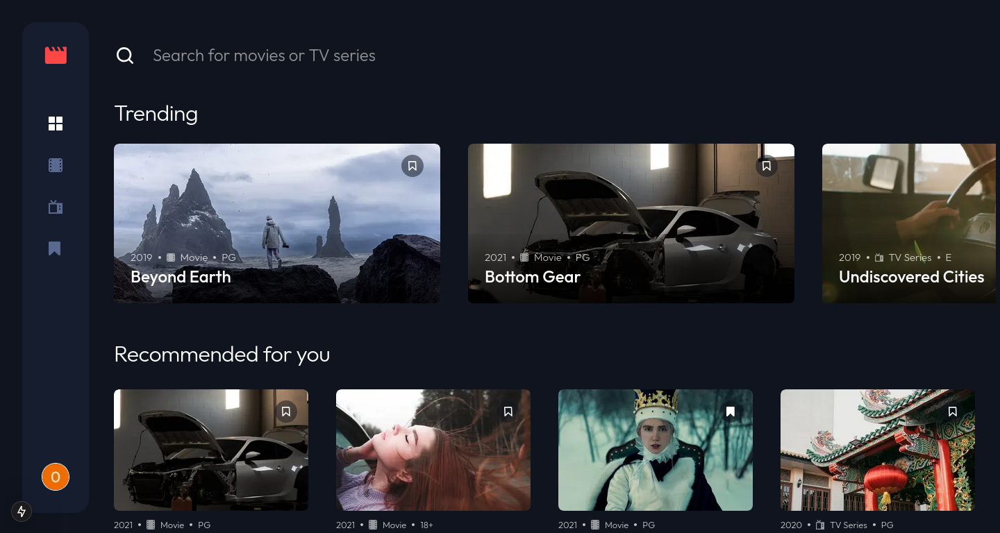
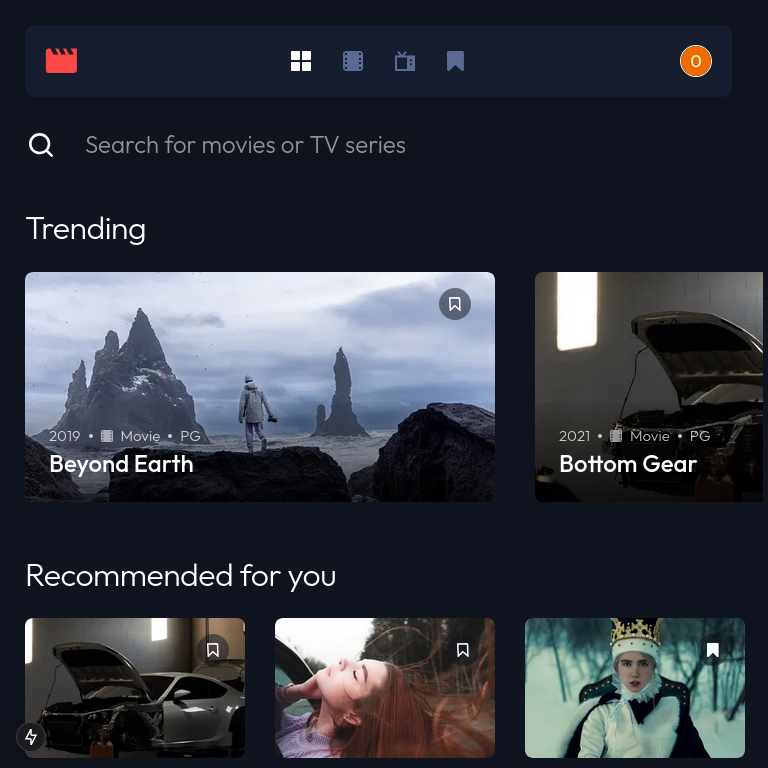
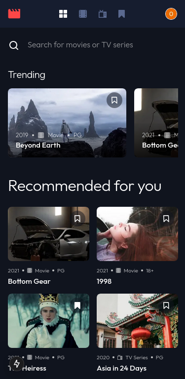
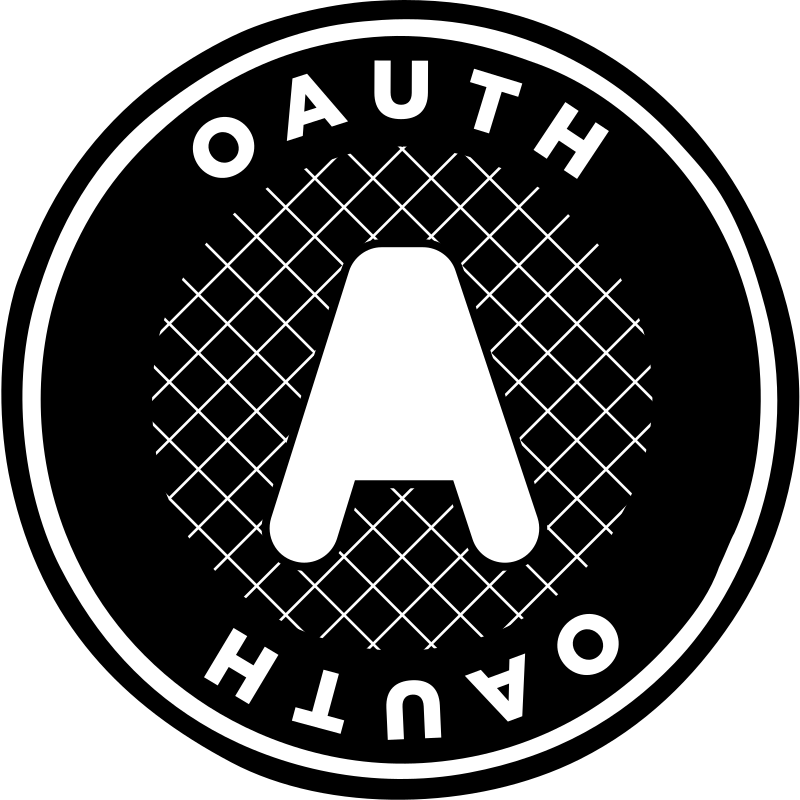

# 🎬 Frontend Mentor - Entertainment Web App Solution

This is my solution for the [Entertainment web app challenge](https://www.frontendmentor.io/challenges/entertainment-web-app-J-UhgAW1X) on Frontend Mentor. The challenge consists of developing an entertainment app where users can browse different media categories, add favorites and search for movies and series.

## 📌 Table of Contents

- [Overview](#overview)
  - [The Challenge](#the-challenge)
  - [Screenshots](#screenshots)
  - [Links](#links)
- [My Process](#my-process)
  - [Built With](#built-with)

---

## 🔍 Overview

### 🎯 The Challenge

Users should be able to:

✅ View the layout optimized for different screen sizes 
✅ View hover states on all interactive elements 
✅ Navigate between the "Home", "Movies", "TV Series" and "Bookmarked Shows" pages 
✅ Add/Remove favorites in movies and series 
✅ Search for TV shows and movies 
✅ **Bonus:** Create this project as a full-stack application 
✅ **Bonus:** Implement authentication with login/registration 

---

## 🖼 Screenshots

  <h3>📺 Desktop View</h3>
  

  <h3>📱 Tablet View</h3>
  

  <h3>📱 Mobile View</h3>
  

---

## 🔗 Links

- 🔗 **Solution URL:** [Frontend Mentor](https://www.frontendmentor.io/solutions/SEU-LINK)
- 🌍 **Live Site URL:** [Acesse o site](https://SEU-SITE.com)

---

## 🚀 My Process

### 🛠 Built With

  
  
  
  
  
  

