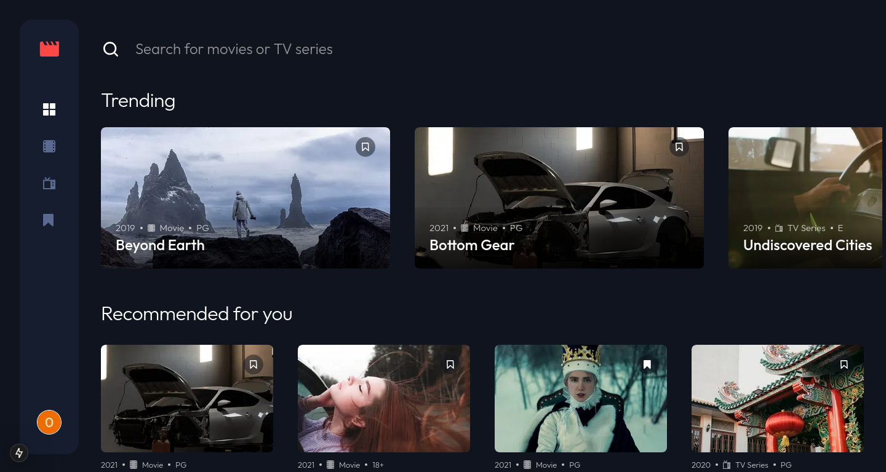
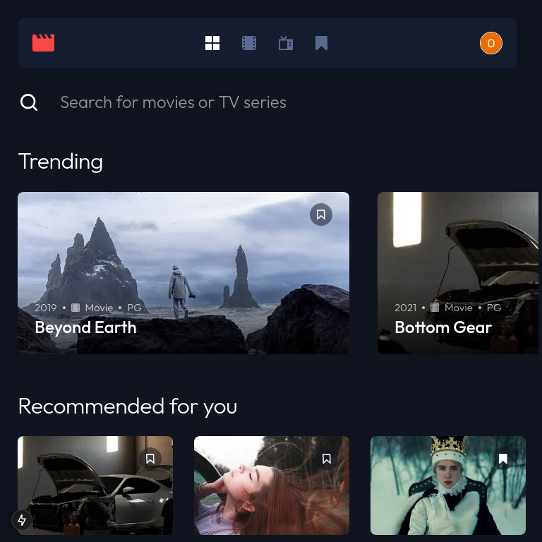
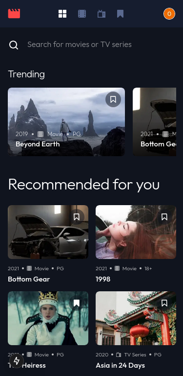

<h1 align="center">Frontend Mentor - Entertainment web app solution</h1>

This is a solution to the [Entertainment web app challenge on Frontend Mentor](https://www.frontendmentor.io/challenges/entertainment-web-app-J-UhgAW1X). Frontend Mentor challenges help you improve your coding skills by building realistic project.

<h2 align="center">Table of contents</h2>

- [Overview](#overview)
  - [The challenge](#the-challenge)
  - [Screenshot](#screenshot)
  - [Links](#links)
- [My process](#my-process)
  - [Built with](#built-with)
  - [What I learned](#what-i-learned)
  - [Continued development](#continued-development)
  - [Useful resources](#useful-resources)
- [Author](#author)
- [Acknowledgments](#acknowledgments)

<h2 align="center">Overview</h2>

<h3 align="center">The challenge</h3>

Users should be able to:

- View the optimal layout for the app depending on their device's screen size
- See hover states for all interactive elements on the page
- Navigate between Home, Movies, TV Series, and Bookmarked Shows pages
- Add/Remove bookmarks from all movies and TV series
- Search for relevant shows on all pages
- **Bonus**: Build this project as a full-stack application
- **Bonus**: If you're building a full-stack app, we provide authentication screen (sign-up/login) designs if you'd like to create an auth flow

<h2 align="center">Screenshot</h2>

  

    <h3>Desktop View</h3>
    
  

  

    <h3>Tablet View</h3>
    
  

  

    <h3>Mobile View</h3>
    
  

<h2 align="center">Links</h2>

Solution URL: <a href="" target="_blank" rel="noreferrer">link</a>

Live Site URL: <a href="" target="_blank" rel="noreferrer">Add live site URL here</a>

<h2 align="center">My process</h2>

<h3 align="center">Built with</h3>

  
  
  
  
  

